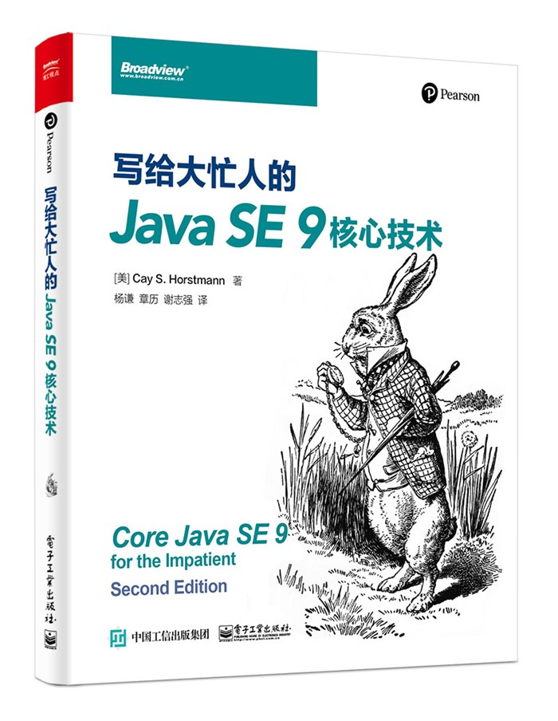

# 写给大忙人的Java SE 9核心教程  
## Core Java SE 9 for the impatient Second Edition  

这是该书每个章节的课后练习答案，由本人编写。由于本人能力有限，无法保证答案的正确和完整性，仅供许学习和参考。  
如果有任何建议，请发起Issues。  
源码放在java路径下，sec表示章节，exercise表示题目。  
This is an after-lab exercise answer for each chapter of the book, written by
 myself.  
Due to my limited ability, I cannot guarantee the correctness and 
completeness of the answer, and it is for study and reference only.  
If you have any suggestions, please launch Issues.  
The source code is placed in the java path, sec represents the chapter, and exercise represents the 
exercise.  

  

> ### 目录  

* 第1章　基本的编程结构  
* 第2章　面向对象编程  
* 第3章　接口和lambda表达式  
* 第4章　继承与反射  
* 第5章　异常、断言和日志处理  
* 第6章　泛型编程  
* 第7章　集合  
* 第8章　Stream  
* 第9章　输入与输出处理  
* 第10章　并发编程  
* 第11章　注解  
* 第12章　日期和时间API  
* 第13章　国际化  
* 第14章　编译与脚本  
* 第15章　Java平台模块系统  
